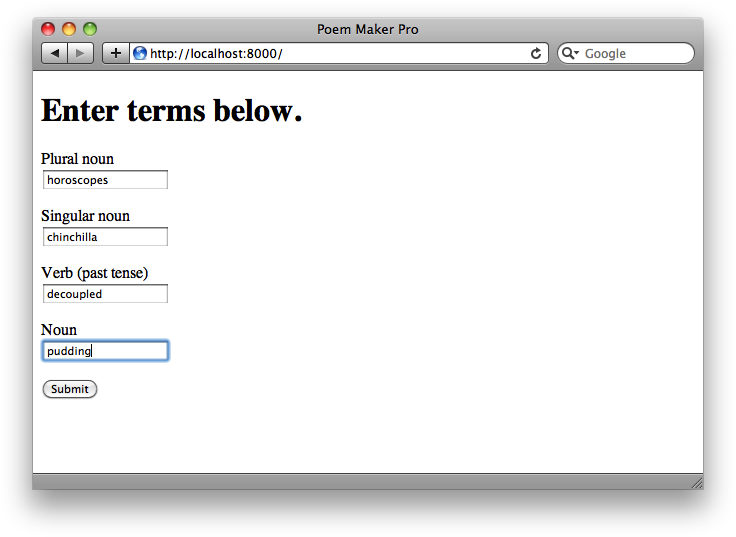

#第二章

**表单和模板**

**Forms and Templates**

在第一章里，我们考察了使用Tornado建立一个web应用的基本知识。涵盖了处理器（handlers）、HTTP请求方式以及Tornado框架的整体架构。在本章中，我们将探究一些在构建web应用时可能会用到的更为强大的特性。

和其它web框架一样，Tornado的一个主要目标就是**帮助使用者更快地写出应用**，尽可能**干净地重用更多代码**。Tornado具备足够的灵活性，允许开发者使用将近所有Python所支持的模板语言，她本身就在`tornado.template`模块中包含有一个轻量快速灵活的模板语言（While Tornado is flexible enough to allow you to use nearly any template language supported by Python, it contains a lightweight, fast, and flexible templating language within the `tornado.template` module）。

##简单示例：诗歌制造专家

**Simple Example: Poem Maker Pro**

让我们以一个叫做*Poem Maker Pro*的简单示例开始。Poem Maker Pro是一个提供了用户去填写的表单的web应用，然后处理出那个表单的结果。示例2-1给出了Python代码。

*示例2-1, 简单表单和模板：poemmaker.py*

```python
#!/usr/bin/env python2.7
# -*- coding: utf-8 -*-

import os.path

import tornado.httpserver
import tornado.ioloop
import tornado.options
import tornado.web

from tornado.options import define, options
define("port", default=8000, help="run on the given port", type=int)


class IndexHandler(tornado.web.RequestHandler):
    def get(self):
        self.render('index.html')


class PoemPageHandler(tornado.web.RequestHandler):
    def post(self):
        noun1 = self.get_argument('noun1')
        noun2 = self.get_argument('noun2')
        noun3 = self.get_argument('noun3')
        verb = self.get_argument('verb')
        self.render('poem.html', roads=noun1, wood=noun2, made=verb,
                difference=noun3)


if __name__ == "__main__":
    tornado.options.parse_command_line()
    app = tornado.web.Application(
        handlers=[(r'/', IndexHandler), (r'/poem', PoemPageHandler)],
        template_path=os.path.join(os.path.dirname(__file__), "templates")
        )
    http_server = tornado.httpserver.HTTPServer(app)
    http_server.listen(options.port)
    tornado.ioloop.IOLoop.instance().start()
```

除*poemmaker.py*外，还需要位于名为*templates*子目录下的示例2-2及2-3中展示的两个文件。

*例2-2, Poem Maker表单: index.html*

```html
<!DOCTYPE html>
<html>
    <head><title>Poem Maker Pro</title></head>
    <body>
        <h1>Enter terms below.</h1>
        <form method="post" action="/poem">
        <p>Plural noun<br><input type="text" name="noun1"></p>
        <p>Singular noun<br><input type="text" name="noun2"></p>
        <p>Verb (past tense)<br><input type="text" name="verb"></p>
        <p>Noun<br><input type="text" name="noun3"></p>
        <input type="submit">
        </form>
    </body>
</html>
```

*例2-3, Poem Maker模板：poem.html*

```html
<!DOCTYPE html>
<html>
    <head>
        <title>Poem Maker Pro</title>
        <meta http-equiv="Content-Type" content="text/html; charset=UTF-8" />
    </head>
    <body>
        <h1>你的诗歌</h1>
        <p>Two {{roads}} deverged in a {{wood}}, and I&mdash;<br>
        I took the one less travelled by,<br>
        And that has {{made}} all the {{difference}}
        </p>
    </body>
</html>
```

此时在命令行像这样运行本程式。

`$ python poemmaker.py --port=8000`

现在，将web浏览器指向`http://localhost:8000`。在web浏览器请求根资源（“/”）时，该Tornado程式就会渲染*index.html*，显示出图2-1中的简单HTML表单。


*图2-1, Poem Maker Pro: 输入表单*

