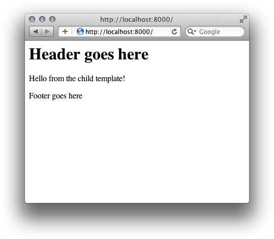
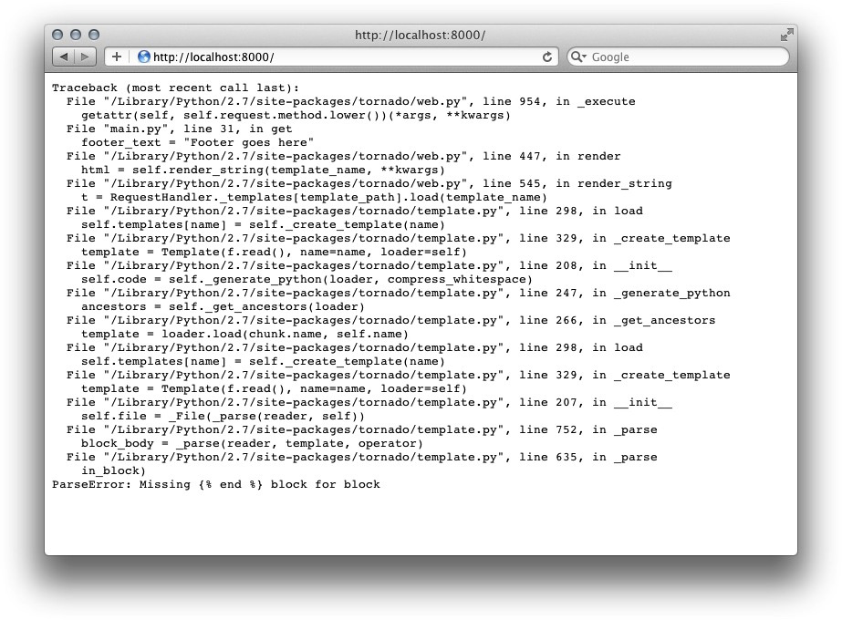

#第三章

**模板扩展**

**Extending Templates**

在第二章中，见识了如何使用Tornado模板系统，来轻易地将信息从请求处理器（handlers）传递给web页面，同时在方便地插入动态数据时，还能保持web标记的干净整洁。但是，大部分站点都会要利用到多用途内容，比如页面头部、底部及布局网格等（most site will want to make use of repurposable content like headers, footers, and layout grids）。本章中，就会研究如何通过拓展Tornado模板（by extending Tornado templates），或者说通过使用UI模块（UI modules），达到这个目的。

##HTML块及置换

**Blocks and Substitutions**

在费时费力地为web应用建立并设计好模板后，就会理所当然地想要尽可能多地在Python后端重用这些前端代码，对不对？还好！Tornado可以让你这样做。**通过其`extend`和`block`语句，Tornado支持模板继承**（template inheritance），此特性给予了制作流畅的、在适当时候具备多种用途的模板的掌控与灵活性（give you the control and flexibility to make fluid templates that can be repurposed as you see fit）。

要扩展某个现有模板，只需在新的模板文件顶部，放上``。比如使用下面的方式，就可以将一个父模板(a parent template, 这里是*main.html*)，扩展进入某个新的模板中。

``

这就会令到新的文件继承*main.html*中的所有标签，并接着改写那些需要改写的内容。有了此系统，就可以创建出一些主模板，转换进入其它为特殊需求的子页面，且同时有着可用的默认及动态文本和标签（With this system, you can create master templates, switch in other sub-pages for special needs, and have both default and dynamic text and markup ready to go）。


###块基础

**Basics of Blocks**

模板扩展令到重复使用先前编写的内容容易起来，但除非能**适用并修改这些先前的模板**，那也是没什么用的。**`block`语句**正是为解决这个问题。

**块语句将某个模板中的一些在扩展该模板时打算改变的元素封装起来**。比如，为运用上一个在每个页面中都可重写的动态头部，就可以将该头部放在父模板*main.html*中。


```html
    <head>
    
    </head>
```

接着，要从其子模板（the child template）*index.html*重写那个``部分，就只需要引用那个名字的块，并将想要的任何内容放入就可以了。

```python




    <h1>Hello, world!</h1>


任何继承了该模板的文件，都可以包含上其自己的``及``标签，来同样插入一些不同的内容。

而要从web应用调用这个子模板，只需像之前渲染其它模板一样，从Python脚本对其进行渲染即可。如下面这样。

```python
class MainHandler(tornado.web.RequestHandler):
    def get(self):
        self.render("index.html")
```

那么在这里，装入*index.html*时，来自*main.html*的`body`区块就会以消息“Hello world!”填充（见图3-1）。

好了，可以看看这项特性在处理整个页面结构时会多么有用，同时在多页面站点上多么节约时间。更棒的是，可为所有页面都用上多个的块，那么像是页面头部和底部这样的动态元素就可以包含在同一个流中（Better yet, you can make use of multiple blocks for each page, so dynamic elements like headers and footers can be included in the same flow）。

作为一个示例，将多个区块加入到父模板*main.html*中。

```html
<html>
    <body>
        <header>
            
        </header>
        <content>
            
        </content>
        <footer>
            
        </footer>
    </body>
</html>
```

就可以从扩展该父模板*main.html*时，从子模板*index.html*引用这些区块。

```python


    <h1>{{ header_text }}</h1>


    <p>Hello from the child template!</p>


    <p>{{ footer_text }}</p>

```

Python脚本就像以前一样装入该子模板，除了在本例中会传入一些用在该模板中的字串变量（如图3-2所示）。

```python
class MainHandler(tornado.web.RequestHandler):
    def get(self):
        self.render(
            "index.html",
            header_text = "Header goes here",
            footer_text = "Footer goes here"
        )
```


*图3-2, 模板区块基础*

在**父模块的区块语句中，同样可以放入默认文本及标签**，在扩展模板（子模板）没有指定其自己版本的该区块时，这些默认文本和标签就会按原样渲染出来。如此而来，就可以根据页面的不同，而仅替换那些需要替换的内容，**这在要包含或替换脚本、CSS文件及标签块时，尤其有用**。



*图3-3, 模板区块报错*

